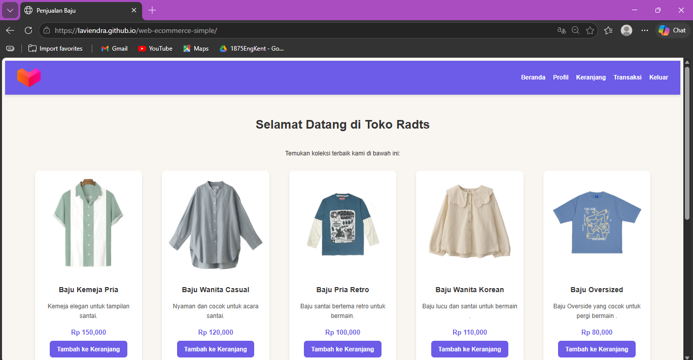

# Simple E-Commerce Website

A simple fashion e-commerce website project created for a Semester 2 midterm assignment.

This website was built using HTML, CSS, and JavaScript with a focus on frontend layout and basic shopping features.

## Features
- Product catalog display
- Shopping cart page
- Simple checkout flow
- Responsive layout
- Modern e-commerce style UI

## Tech Stack
- HTML
- CSS
- JavaScript

## Preview

## Notes
This project was created for learning purposes and is still under development.  
Some features such as the checkout system are not fully functional yet.

## Purpose
Built as a practice project to improve frontend web development skills and understand the basic flow of an e-commerce website.
